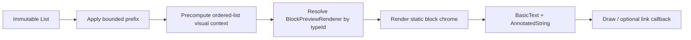

# CascadeDocumentPreview — Detailed Implementation Plan


**Target repository:** `CascadeEditor`  
**Primary source root:** `editor/src/commonMain/kotlin/io/github/linreal/cascade/editor/`  
**Primary test roots:** `editor/src/commonTest/` and `editor/src/desktopTest/`  

## Executive Summary

`CascadeDocumentPreview` should be a stateless, non-editable document renderer for bounded previews such as note cards, search results, feeds, history screens, and permission-independent content summaries.

It must not be implemented as a thin wrapper around `CascadeEditor(readOnly = true)`. Read-only mode preserves the full editor runtime because it intentionally supports focus, text selection, link hit-testing, and a transition back to editing. A preview has a different performance contract:

- no `EditorStateHolder`;
- no `BlockTextStates` or `BlockSpanStates`;
- no `TextFieldState` or `BasicTextField`;
- no history trackers or full-document checkpoints;
- no `snapshotFlow` observers;
- no focus, IME, keyboard, slash-command, toolbar, link-editing, drag, block-selection, or auto-scroll infrastructure;
- no nested scroll container;
- no document mutation or normalization;
- static rendering directly from immutable `Block` snapshots.

The recommended implementation uses `BasicText` plus an `AnnotatedString` for built-in text blocks, shares pure visual mapping and built-in block chrome with the editor where practical, and introduces an opt-in preview-renderer contract for custom block types. Existing editor renderers must never be invoked as an automatic preview fallback because they may depend on editor-only CompositionLocals, mutable callbacks, platform views, or `BlockRenderScope`.

### Recommended delivery shape

| Delivery level                  | Scope                                                                                |
| ------------------------------- | ------------------------------------------------------------------------------------ |
| Built-in vertical slice         | Built-in blocks, bounded static layout, no custom preview renderer                   |
| Production-ready public feature | Public API, built-ins, links, accessibility contract, safe fallback, tests, docs     |
| Full custom-block preview story | Public extension seam, custom sample, platform-view guidance, compatibility coverage |
| Android performance proof       | Macrobenchmark module/scenarios and trace review                                     |
| Native Swift/UIKit facade       | Preview controller/view and native custom-preview adapter                            |

The recommended v1 release is the production-ready public feature plus an Android performance proof. Native Swift/UIKit exposure can be a follow-up unless it is a release requirement.

---

## Problem Statement

A grid containing 6–10 read-only `CascadeEditor` instances may be acceptable for a small MVP, but it retains substantial editor machinery:

- `CascadeEditor` creates a `LazyColumn` and editor-level runtime objects for every card.
- Every visible text block creates a `TextFieldState`, `BasicTextField`, span transformation, focus/key handler, history tracker, and text/selection observer.
- Every text history tracker initializes from a full-document checkpoint.
- Read-only mode disables mutation and several gesture systems, but it does not become a static renderer.
- The internal vertical `LazyColumn` remains scrollable, creating a same-direction nested scrolling problem inside a `LazyVerticalGrid`.

The feature should provide the same document-model fidelity and substantially the same built-in visual language without paying the text-editing cost.

## Goals

- Render the beginning of a Cascade document efficiently in bounded card-sized surfaces.
- Match the editor’s built-in typography, colors, block spacing, indentation, list markers, quote styling, code styling, todo state, divider styling, and rich-text span behavior.
- Render directly from `List<Block>` without creating or binding editor runtime state.
- Avoid any internally scrollable container.
- Support a predictable block and text-line budget.
- Support optional link opening without enabling link editing or text focus.
- Define explicit behavior for text selection and copy.
- Contain renderer failures using the existing crash policy model.
- Provide an opt-in, stateless extension seam for custom preview renderers.
- Preserve source and binary compatibility for existing `BlockRenderer` and `ScopedBlockRenderer` consumers.
- Work from shared `commonMain` code across Android, iOS, desktop, and wasm.
- Include a representative grid sample and objective performance validation.

## Non-Goals

- Replacing `CascadeEditor(readOnly = true)`.
- Transitioning an already-mounted preview instance directly into editing.
- Supporting cursor placement, IME input, keyboard shortcuts, toolbar state, or editor focus.
- Supporting block selection, drag-and-drop, slash commands, undo/redo, or link editing.
- Automatically generating a semantic summary of a note.
- Persisting or mutating a truncated preview document.
- Acting as a virtualized full-document reader.
- Owning application navigation or whole-card click behavior.
- Automatically loading images, embeds, or remote media.
- Automatically reusing arbitrary editor renderers in preview mode.
- Providing the native Swift/UIKit facade in the first implementation unless explicitly pulled into scope.

---

## Current Architecture Assessment

### Reusable assets

- `Block`, `BlockType`, `BlockContent`, `TextSpan`, and `SpanStyle` are immutable document-model inputs.
- `SpanMapper` already converts domain span styles into Compose `SpanStyle` runs.
- `CommentModel.rememberCommentAnnotatedString()` proves that Cascade text plus spans can be rendered statically without an editor.
- `resolveOrderedListPrefixStyles()` and `formatOrderedListPrefix()` are pure or effectively pure list-visual helpers.
- `blockIndentationInset()` is a pure indentation geometry helper.
- `CascadeEditorTheme`, colors, typography, dimensions, and localization types can be provided through the existing theme CompositionLocals.
- The existing crash-handling primitive can protect per-block preview rendering.

### Coupling that must be removed or bypassed

- `TextBlockRenderer` combines block chrome with `TextBlockField`, which mounts editing infrastructure.
- `TodoBlockRenderer` combines the static todo visual with an interactive `toggleable`.
- `BlockRenderer` receives editor callbacks and may assume editor state exists.
- `ScopedBlockRenderer` deliberately requires a live `BlockRenderScope` and may mutate document state.
- `BlockRegistry` currently has one renderer map intended for editor rendering.
- `SpanMapper` applies styles to a `TextFieldBuffer` with the editor’s leading sentinel offset; preview text has no sentinel.
- Existing editor indentation and font transitions animate even when a preview should be static and cheap.

### Architectural conclusion

The preview should share pure mapping and visual primitives, not editor runtime components. Where sharing would introduce `mode` branches throughout editor code, prefer a small dedicated preview renderer that composes extracted primitives.

---

## Locked Design Decisions

1. **The public input is immutable document data.**  
   `CascadeDocumentPreview` accepts `List<Block>`, not `EditorStateHolder`, `BlockTextStates`, or `BlockSpanStates`.

2. **The component is non-scrollable.**  
   It uses a bounded static layout and never installs `verticalScroll`, `LazyColumn`, or a nested-scroll connection. The host owns the grid/list scroll and card height.

3. **The preview never modifies its input.**  
   It must not append the editor’s trailing empty paragraph, normalize indentation, renumber lists, or write back truncated text.

4. **Preview limits are presentation limits.**  
   A block limit selects an ordered prefix of the input list for rendering. A line limit controls `BasicText` measurement and overflow. Neither produces a new persistence model.

5. **Built-in text uses `BasicText`, not `BasicTextField`.**  
   There is no sentinel, `TextFieldState`, focus requester, input transformation, key handler, or IME configuration.

6. **No animation by default.**  
   Font size, todo state, and indentation are rendered directly at their target values. Grid previews should not create animation state when cells enter composition.

7. **Editor renderers are not the preview fallback.**  
   Existing `BlockRenderer` instances are never invoked automatically from `CascadeDocumentPreview`.

8. **Custom preview rendering is opt-in.**  
   A new sibling contract is added instead of changing `BlockRenderer.Render(...)` or adding a render-mode parameter.

9. **One `BlockRegistry` may hold both renderer kinds.**  
   The existing registry gains a separate preview-renderer map and fallback. This lets consumers hoist one registry for an editor and its previews without conflating the contracts.

10. **Link opening is the only built-in block interaction.**  
    Whole-card click/navigation stays outside the component.

11. **Text selection is off by default.**  
    Preview cards are primarily navigational surfaces. An opt-in selection mode may use `SelectionContainer`, subject to platform QA.

12. **Crash containment applies per block.**  
    A failing custom preview renderer degrades to a safe fallback and reports through the configured error reporter.

13. **The first release should be experimental if the custom renderer API ships.**  
    Use an `ExperimentalCascadePreviewApi` annotation for the preview component, config, and renderer extension seam for at least one minor release.

---

## Product Decisions to Confirm

> [!warning] Default preview budget
> The exact default `maxBlocks` and `maxLinesPerTextBlock` values are product/design decisions. The implementation should expose named tokens or a `GridCard` preset rather than scattering literal values. The sample grid and benchmark should validate the final defaults.

> [!warning] Text selection
> The plan assumes selection/copy is disabled by default and optional. If selection across multiple blocks is a v1 requirement, add native clipboard QA on Android, iOS, desktop, and wasm to the release gate.

> [!warning] Native iOS SDK
> The plan assumes the Compose Multiplatform API ships before a Swift/UIKit facade. If native Swift consumers must instantiate previews directly, include the optional native SDK task in the release scope.

> [!warning] Interactive custom blocks
> A preview renderer is intentionally stateless. If a product expects table-cell controls, media playback, or other interactive custom content inside note cards, that requires a separate capability design and should not be smuggled through editor callbacks.

---

## Proposed Public API

The exact names can change during API review, but the responsibility boundaries should remain stable.

```kotlin
@ExperimentalCascadePreviewApi
@Composable
public fun CascadeDocumentPreview(
    blocks: List<Block>,
    modifier: Modifier = Modifier,
    registry: BlockRegistry = remember { createEditorRegistry() },
    theme: CascadeEditorTheme = CascadeEditorTheme.light(),
    blockStrings: CascadeEditorBlockStrings = CascadeEditorBlockStrings.default(),
    config: CascadeDocumentPreviewConfig = CascadeDocumentPreviewConfig.Default,
    onOpenLink: ((String) -> Unit)? = null,
)
```

```kotlin
@ExperimentalCascadePreviewApi
@Immutable
public data class CascadeDocumentPreviewConfig(
    val maxBlocks: Int,
    val maxLinesPerTextBlock: Int,
    val textOverflow: TextOverflow,
    val textSelectionEnabled: Boolean,
    val linksEnabled: Boolean,
    val crashPolicy: CrashPolicy,
    val onInternalError: CascadeErrorReporter?,
)
```

Recommended config presets:

- `Default` or `GridCard`: bounded, ellipsized, selection disabled, links enabled.
- `Unbounded`: explicit opt-in for non-grid/static document surfaces; still non-scrollable.

The component KDoc must clearly state that consumers rendering many previews should hoist and share a stable registry, theme, and localization objects.

### Custom preview renderer seam

```kotlin
@ExperimentalCascadePreviewApi
public interface BlockPreviewRenderer<T : BlockType> {
    @Composable
    public fun RenderPreview(
        block: Block,
        modifier: Modifier,
        scope: BlockPreviewScope,
    )
}
```

```kotlin
@ExperimentalCascadePreviewApi
@Stable
public interface BlockPreviewScope {
    public val blocks: List<Block>
    public val config: CascadeDocumentPreviewConfig
    public fun getBlock(blockId: BlockId): Block?
    public fun openLink(target: String)
}
```

`BlockPreviewScope` is read-only. It must not expose `dispatch`, `updateBlock`, focus, history, text states, span states, or editor configuration.

### Registry additions

- `registerPreviewRenderer(typeId, renderer)`
- `getPreviewRenderer(blockType)`
- `setUnknownBlockPreviewRenderer(renderer)`
- Optional convenience overload registering descriptor, editor renderer, and preview renderer together.

All preview-registry mutations increment the existing registry revision so a visible fallback can swap to the newly registered renderer without waiting for unrelated recomposition.

---

## Data Flow



Explicitly absent from the flow:

```text
EditorStateHolder
  ├── BlockTextStates / TextFieldState
  ├── BlockSpanStates runtime synchronization
  ├── history checkpoints
  ├── focus / keyboard / IME
  ├── slash / toolbar / link editing
  ├── block gestures / drag
  └── LazyColumn / nested scrolling
```

---

## Proposed File Map

### Create

- `editor/src/commonMain/.../ui/CascadeDocumentPreview.kt`
- `editor/src/commonMain/.../ui/CascadeDocumentPreviewConfig.kt`
- `editor/src/commonMain/.../ui/ExperimentalCascadePreviewApi.kt`
- `editor/src/commonMain/.../registry/BlockPreviewRenderer.kt`
- `editor/src/commonMain/.../registry/BlockPreviewScope.kt`
- `editor/src/commonMain/.../ui/DefaultBlockPreviewScope.kt`
- `editor/src/commonMain/.../richtext/PreviewAnnotatedString.kt`
- `editor/src/commonMain/.../ui/renderers/PreviewTextBlockRenderer.kt`
- `editor/src/commonMain/.../ui/renderers/PreviewTodoBlockRenderer.kt`
- `editor/src/commonMain/.../ui/renderers/PreviewDividerBlockRenderer.kt`
- `editor/src/commonMain/.../ui/renderers/UnknownBlockPreviewRenderer.kt`
- `editor/src/commonTest/.../PreviewAnnotatedStringTest.kt`
- `editor/src/commonTest/.../BlockPreviewRegistryTest.kt`
- `editor/src/commonTest/.../CascadeDocumentPreviewConfigTest.kt`
- `editor/src/desktopTest/.../ui/CascadeDocumentPreviewTest.kt`
- `docs/DocumentPreview.md`

### Modify

- `editor/src/commonMain/.../registry/BlockRegistry.kt`
- `editor/src/commonMain/.../ui/EditorRegistry.kt`
- `editor/src/commonMain/.../richtext/SpanMapper.kt`
- `editor/src/commonMain/.../ui/renderers/TextBlockRenderer.kt`
- `editor/src/commonMain/.../ui/renderers/TodoBlockRenderer.kt`
- Potentially `editor/src/commonMain/.../ui/renderers/DividerBlockRenderer.kt`
- `ARCHITECTURE.md`
- `README.md`
- Public API snapshot files under `editor/api/`
- Sample navigation and new preview sample files under `sample/src/commonMain/...`

The final implementation may combine small preview renderer files if cohesion is better, but editor runtime logic and preview rendering must remain visibly separated.

---

# Implementation Tasks

## Task 1 — Lock the preview contract and representative fixtures


**Dependencies:** None

### Context

The largest risk is scope drift: a “preview” can accidentally become another read-only editor, a full document reader, or an application-specific note-card component. Lock the behavioral contract before extracting rendering code.

### Scope

- Create `CascadeDocumentPreviewConfig.kt`.
- Create `ExperimentalCascadePreviewApi.kt`.
- Create common-test fixtures representing built-in block and span combinations.
- Add the public API proposal to `docs/DocumentPreview.md` as an initial contract section.

### Requirements

- Define bounded preview configuration and validation.
- Reject invalid limits deterministically, such as non-positive block or line counts, unless a named unbounded sentinel/preset is used.
- State that the preview:
  - is stateless;
  - is non-scrollable;
  - never mutates blocks;
  - never appends a trailing block;
  - is not a permission boundary;
  - does not replace editor read-only mode.
- Create at least three reusable fixtures:
  - `simplePreviewDocument`: heading, paragraph, todo, divider;
  - `spanHeavyPreviewDocument`: every built-in span style plus overlaps;
  - `structuralPreviewDocument`: nested bullet/numbered/todo outline, quote, multiline code, unknown block.

### Restrictions and considerations

- Do not introduce `EditorStateHolder` into preview types.
- Do not reuse `CascadeEditorConfig`; preview behavior is not editor interaction policy.
- Do not define automatic content summarization.
- Do not make the note-card container or navigation callback part of the library API.
- Keep exact numeric defaults in named constants or presets so they can be tuned after benchmark/design review.

### Tests

- Given default config, when inspected, then limits and interaction defaults match the documented contract.
- Given every invalid limit, when config is constructed, then validation fails with an actionable message.
- Given `Unbounded`, when constructed, then it is valid and does not rely on magic negative numbers.
- Given `copy(...)`, when unrelated fields change, then crash and interaction fields are preserved.

### Definition of done

- [ ] Config and opt-in annotation compile in `commonMain`.
- [ ] Config tests pass.
- [ ] Contract explicitly distinguishes preview from read-only editor mode.
- [ ] Default budget remains centralized.
- [ ] No editor runtime dependency has been introduced.

---

## Task 2 — Add the custom preview renderer contract and registry channel


**Dependencies:** Task 1

### Context

Existing editor renderers are unsafe as a generic preview fallback. A separate extension seam preserves existing APIs while allowing custom blocks to provide lightweight representations.

### Scope

- Create `registry/BlockPreviewRenderer.kt`.
- Create `registry/BlockPreviewScope.kt`.
- Modify `registry/BlockRegistry.kt`.
- Create `ui/DefaultBlockPreviewScope.kt`.
- Add `BlockPreviewRegistryTest.kt`.

### Requirements

- Store preview renderers separately from editor renderers.
- Resolve preview renderers by `BlockType.typeId`.
- Support an unknown/custom preview fallback.
- Increment the registry revision on preview registration and fallback changes.
- Keep existing descriptor and editor-renderer behavior byte-for-byte unchanged.
- Provide a read-only scope with:
  - original ordered block list;
  - current preview config;
  - block lookup;
  - policy-aware link opening.
- `openLink()` must be a no-op when links are disabled or no opener is supplied.

### Restrictions and considerations

- Do not modify the existing `BlockRenderer.Render(...)` signature.
- Do not add a mode flag to `BlockRenderer`.
- Do not call an editor renderer when a preview renderer is absent.
- Do not expose mutable collections from the scope.
- Do not expose editor callbacks, `EditorAction`, focus, or state holders.
- Preserve registry mutation semantics and snapshot observation.
- Document that registries should be configured before being shared across threads; mutation remains a UI-thread-oriented operation.

### Tests

- Given an empty registry, when a preview renderer is requested, then null/fallback behavior is correct.
- Given a registered preview renderer, when resolved by matching type ID, then the same instance is returned.
- Given an editor renderer only, when preview resolution runs, then the editor renderer is not returned.
- Given an unknown type and fallback, when resolved, then the fallback is returned.
- Given a preview registration after initial lookup, when revision is observed, then revision increases.
- Given links disabled, when custom scope calls `openLink`, then the host callback is not invoked.
- Given a missing block ID, when `getBlock` is called, then null is returned without failure.

### Definition of done

- [ ] Existing renderer interfaces remain source compatible.
- [ ] Registry tests cover separate channels and revision behavior.
- [ ] Preview scope has no mutation surface.
- [ ] KDoc explains why editor renderers are not automatic fallbacks.
- [ ] `apiCheck` failure is expected only for the intentional additive API.

---

## Task 3 — Extract shared rich-text visual mapping and add an AnnotatedString adapter


**Dependencies:** Task 1  
**Can parallelize with:** Task 2

### Context

`SpanMapper` already owns the editor’s domain-to-Compose visual rules, including overlap handling, link decoration, inline-code background, and base-decoration combination. Preview rendering needs the same mapping without a `TextFieldBuffer` or sentinel offset.

### Scope

- Modify `richtext/SpanMapper.kt`.
- Create `richtext/PreviewAnnotatedString.kt`.
- Create `PreviewAnnotatedStringTest.kt`.
- Refactor the sample comment mapper later to use public/domain logic if appropriate; do not couple the editor module to the sample.

### Requirements

- Preserve one canonical mapping from Cascade `SpanStyle` to Compose span runs.
- Keep field-specific sentinel offset handling only in the text-field adapter.
- Add a pure builder that:
  - accepts visible text and document spans;
  - clamps ranges safely;
  - drops empty ranges;
  - preserves overlapping compatible styles;
  - preserves combined underline + strikethrough behavior;
  - styles links exactly as the editor does;
  - drops unsupported custom span visuals consistently with the editor;
  - never mutates the input span list.
- Ensure code blocks can bypass span rendering because `supportsSpans = false`.
- Cache the resulting `AnnotatedString` with stable `remember` keys at the composable call site.

### Restrictions and considerations

- Do not duplicate the style `when` mapping in a second production location.
- Do not apply the editor’s leading zero-width-space offset to preview ranges.
- Do not trust incoming span ranges to be normalized.
- Preserve `CrashPolicy` handling around any consumer-provided/custom mapping if that becomes extensible later.
- Confirm current highlight behavior: preview must match the editor’s themed highlight visual rather than silently adopting a different color policy from the comments sample.
- Avoid regular expressions and avoid work proportional to total document size; mapping should be local to the rendered text block.

### Tests

- One test for every built-in span style.
- Range clamping for negative, oversized, reversed, and empty ranges.
- Bold + italic overlap.
- Underline + strikethrough overlap produces combined decoration.
- Link + explicit underline does not produce an unintended double-decoration region.
- Base todo strikethrough remains visible under a styled run.
- Unsupported custom span is ignored without affecting supported spans.
- Empty text and empty spans return a valid empty `AnnotatedString`.
- Input lists remain structurally unchanged.
- Output contains no sentinel character.

### Definition of done

- [ ] Editor `OutputTransformation` behavior remains unchanged.
- [ ] Preview adapter uses the same canonical mapped runs.
- [ ] Span tests cover parity and malformed ranges.
- [ ] Existing `SpanMapperTest` passes unchanged or with parity-focused additions.
- [ ] No preview code depends on `TextFieldState` or `TextFieldBuffer`.

---

## Task 4 — Extract reusable static built-in block visuals


**Dependencies:** Task 1  
**Can partially parallelize with:** Tasks 2 and 3

### Context

Built-in renderer visuals are currently intertwined with editor-only behavior. Extract the smallest stable visual primitives so preview and editor do not drift, without forcing both paths through a complex render-mode switch.

### Scope

- Modify `ui/renderers/TextBlockRenderer.kt`.
- Modify `ui/renderers/TodoBlockRenderer.kt`.
- Potentially modify `DividerBlockRenderer.kt`.
- Reuse `blockIndentationInset`, ordered-list prefix formatting, theme, and dimensions.
- Add pure geometry/style tests where new helper functions are introduced.

### Requirements

Extract or expose internal primitives for:

- text style resolution for paragraphs, headings H1–H6, quote, code, and list text;
- quote border/background chrome;
- code block background/padding chrome;
- bullet and numbered-list prefix layout;
- static indentation inset;
- todo checkbox/checkmark drawing;
- divider visual.

The editor must retain its current:

- text field;
- focus behavior;
- input behavior;
- animated type transitions;
- interactive todo toggle;
- selection and drag visuals.

The preview must be able to use:

- static target text style;
- static indentation without `animateDpAsState`;
- static todo state without `toggleable`;
- no focus or selection arguments.

### Restrictions and considerations

- Prefer small content-slot primitives over a large `RenderMode` enum.
- Do not make internal implementation helpers public unless custom preview renderers genuinely need them.
- Do not change padding, list-gutter widths, quote geometry, or code geometry during extraction.
- Avoid creating animation state in preview compositions.
- Maintain exact editor semantics and screenshots before optimizing preview density.

### Tests

- Existing renderer tests remain green.
- Pure text-style resolver returns the correct typography slot for every built-in type.
- Static indentation matches the editor’s target indentation at every supported depth.
- Ordered-list prefixes match decimal, alphabetic, and roman ancestry behavior.
- Todo indicator renders checked/unchecked state without exposing a click action in preview mode.
- Code block uses monospace typography and ignores spans.

### Definition of done

- [ ] Editor visuals and interaction behavior do not regress.
- [ ] Preview can compose built-in chrome without calling `TextBlockField`.
- [ ] No preview primitive creates focus, pointer input, or animation state.
- [ ] Shared helpers have focused KDoc explaining their editor/preview parity role.

---

## Task 5 — Implement built-in preview renderers


**Dependencies:** Tasks 2, 3, and 4

### Context

With the registry channel, static rich-text adapter, and shared chrome available, implement dedicated preview renderers for all built-in block types.

### Scope

- Create `PreviewTextBlockRenderer.kt`.
- Create `PreviewTodoBlockRenderer.kt`.
- Create `PreviewDividerBlockRenderer.kt`.
- Modify `ui/EditorRegistry.kt` to register built-in preview renderers.
- Add focused common/desktop tests.

### Requirements

- Paragraph: themed body text.
- Heading: correct H1–H6 typography.
- Bullet list: prefix gutter and indentation matching the editor.
- Numbered list: derived prefix style and stored number.
- Todo: static checked/unchecked control plus body text; checked text retains base strikethrough.
- Quote: quote chrome plus italic body style.
- Code: monospace, preserved line breaks, code background, no span styling.
- Divider: same visible line geometry as the editor.
- All text blocks:
  - use `BasicText`;
  - apply `AnnotatedString` span mapping when supported;
  - obey max-line and overflow config;
  - never gain focus;
  - never expose editable semantics.

### Restrictions and considerations

- Do not invoke `TextBlockRenderer` or `TextBlockField`.
- Do not use `BasicTextField(readOnly = true)`.
- Do not create disabled interactive controls merely to obtain visuals.
- Use stable keys/remember inputs so grid-item recomposition does not rebuild annotated strings unnecessarily.
- Ensure checked-todo base strikethrough composes correctly with explicit underline, link, and inline-code spans.
- Multiline code overflow needs explicit tests because ellipsis behavior can differ from proportional body text.

### Tests

- Compose a document containing every built-in block type and assert visible text/semantics.
- Assert heading/list/quote/code/todo nodes are present with expected structural semantics where observable.
- Assert no node exposes editable-text semantics.
- Assert tapping plain text does not request focus or open a keyboard.
- Assert checked todo exposes checked state but no toggle action.
- Assert `maxLinesPerTextBlock` and overflow apply to each text block.
- Assert code block does not apply stored spans.
- Assert built-in preview renderers are present in `createEditorRegistry()`.

### Definition of done

- [ ] Every built-in block type has a preview renderer.
- [ ] No built-in preview uses editor runtime state.
- [ ] Editor and preview share visual primitives rather than copied constants.
- [ ] Desktop UI tests prove static/non-editable semantics.

---

## Task 6 — Implement the CascadeDocumentPreview container


**Dependencies:** Tasks 1, 2, and 5

### Context

The container supplies theme/context, applies the bounded block prefix, resolves renderers, catches block failures, and lays blocks out without nested scrolling.

### Scope

- Create `ui/CascadeDocumentPreview.kt`.
- Wire `DefaultBlockPreviewScope`.
- Reuse ordered-list visual context and crash containment.
- Create or extend `CascadeDocumentPreviewTest.kt`.

### Requirements

- Accept an ordered `List<Block>`.
- Select no more than the configured block limit.
- Compute ordered-list prefix context from the original prefix needed for correct first-part rendering.
- Use a non-scrollable `Column` or purpose-built non-scrollable layout.
- Apply stable composition keys for blocks.
- Render blocks in source order.
- Resolve preview renderers through `BlockRegistry`.
- Provide existing Cascade theme and localization CompositionLocals needed by built-in/custom preview renderers.
- Use per-block crash containment.
- Clip to the caller-provided bounds where required, without inventing a card size.
- Render empty input as an empty layout; do not append a paragraph.
- Avoid a built-in bottom padding intended for the editor scroll viewport.

### Restrictions and considerations

- No `LazyColumn`, `verticalScroll`, nested scroll, or `ScrollState`.
- No `EditorState` construction solely for rendering.
- No `ensureTrailingTextBlock()`.
- No document normalization or renumbering.
- Stable key strategy must not crash on malformed duplicate block IDs. Prefer a deterministic composite key including index rather than trusting uniqueness at the never-crash boundary.
- Keep block lookup in `BlockPreviewScope` efficient. Build an ID map once per input list if custom renderers need repeated lookup.
- A large unbounded list will compose eagerly; KDoc and presets must make this explicit.

### Tests

- Empty blocks render without children and without failure.
- Input ordering is preserved.
- Block limit renders exactly the configured prefix.
- Hidden blocks are never composed.
- No trailing paragraph is added.
- Duplicate IDs do not crash composition.
- Registry revision causes an already-visible fallback to switch to a newly registered preview renderer.
- Root semantics expose no vertical scroll action.
- A fixed-height preview nested in a `LazyVerticalGrid` can be measured without an infinite-constraint exception.
- A failing renderer degrades only its own block and later blocks still render.

### Definition of done

- [ ] Public preview composable works with built-in renderers.
- [ ] Container has no editor runtime or scroll state.
- [ ] Empty, malformed, and duplicate-ID inputs remain contained.
- [ ] Nested-grid Compose test passes.
- [ ] Per-block failure isolation works.

---

## Task 7 — Add link opening, optional selection, and accessibility semantics


**Dependencies:** Tasks 3, 5, and 6

### Context

Preview cards may need links and copy, but those interactions must not quietly reintroduce text-field infrastructure or conflict with whole-card navigation.

### Scope

- Extend `PreviewAnnotatedString.kt` with link annotations.
- Wire link opening through `BlockPreviewScope`.
- Add optional `SelectionContainer` at the narrowest safe boundary.
- Add accessibility tests and platform QA checklist.

### Requirements

- Existing stored link targets render using the preview link color and underline.
- Links invoke `onOpenLink` only when:
  - links are enabled;
  - the target is present/valid under the existing stored-target policy;
  - the user activates the link rather than the surrounding card.
- Link activation must not focus text or open the IME.
- With selection disabled:
  - text is static;
  - the preview installs no selection handles;
  - outer card click behavior remains available to the host.
- With selection enabled:
  - text can be selected/copied using Compose selection primitives;
  - no sentinel can enter copied text;
  - selection never mutates the document.
- Todos expose their checked state accessibly without a toggle action.
- Unknown/fallback blocks expose an understandable localized label.

### Restrictions and considerations

- Do not reuse editor `LinkPopupController`, `LinkState`, `LinkActions`, or `LinkHitTester`.
- Prefer Compose link annotations over custom pointer hit-testing when cross-platform behavior is sufficient.
- Explicitly test event arbitration when the host wraps the whole preview in `clickable`.
- Selection across multiple block descendants may vary by platform; do not promise it until QA proves it.
- Visually ellipsized text may still expose full source text through semantics. Document this behavior or project text content before rendering if the product requires semantic truncation.

### Tests

- Valid link activates exactly once.
- Links disabled means no activation.
- Missing opener means safe no-op.
- Plain text tap does not invoke link callback.
- Overlapping link and bold/italic styles retain both visuals.
- Outer card click still fires when non-link text is tapped in default mode.
- Link activation does not also fire outer card navigation if event semantics can prevent it.
- Selection-disabled preview exposes no selection action.
- Selection-enabled preview returns exactly visible text without a sentinel.
- Checked/unchecked todo semantics are correct and non-actionable.

### Manual platform QA

- [ ] Android touch link activation and long-press selection.
- [ ] iOS link activation and selection handles.
- [ ] Desktop mouse link activation and drag selection.
- [ ] wasm browser link activation, selection, and clipboard.
- [ ] Screen reader pass on Android and iOS.

### Definition of done

- [ ] Link opening works without editor link infrastructure.
- [ ] Default preview remains non-focusable and card-friendly.
- [ ] Selection behavior is explicit and tested.
- [ ] Accessibility contract is documented.

---

## Task 8 — Harden unknown and custom preview behavior


**Dependencies:** Tasks 2 and 6

### Context

Custom blocks are a first-class Cascade capability. Preview mode must degrade predictably when no lightweight renderer is registered and must contain custom renderer failures.

### Scope

- Create `UnknownBlockPreviewRenderer.kt`.
- Register it as the preview fallback.
- Add custom renderer integration tests.
- Reuse `CrashPolicy`, `CascadeError`, and error reporter contracts.

### Requirements

- If an unknown/custom block has text content, fallback preserves a bounded readable excerpt where safe.
- If content is non-text/custom payload, fallback shows a localized unsupported-block label.
- Fallback must never invoke the editor renderer.
- Custom preview renderers receive only `BlockPreviewScope`.
- A custom renderer failure during composition, measure, or draw is contained according to preview config.
- The error context identifies preview rendering and block type.
- A faulty error reporter cannot turn a contained preview error into a host crash.
- Platform-view guidance states:
  - preview renderer should use a thumbnail/placeholder where possible;
  - it must not mount a second heavy editor/controller;
  - consumers own media lifecycle and caching.

### Restrictions and considerations

- Do not deserialize or interpret custom payloads in the generic fallback.
- Do not call `ScopedBlockRenderer`.
- Do not claim full visual fidelity for custom blocks without a registered preview renderer.
- Keep fallback height bounded so one unsupported block cannot dominate a grid card.

### Tests

- Unknown text block shows a text-preserving fallback.
- Unknown custom-data block shows localized label.
- Existing editor renderer without preview renderer still uses fallback.
- Registered custom preview renderer replaces fallback.
- Throwing custom renderer reports once and falls back.
- Throwing error reporter is contained.
- One failing custom block does not suppress following blocks.

### Definition of done

- [ ] Custom-block behavior is deterministic and documented.
- [ ] No editor renderer is invoked by fallback.
- [ ] Failure containment covers composition/measure/draw.
- [ ] Preview extension example compiles against public API only.

---

## Task 9 — Complete API compatibility and cross-cutting regression coverage


**Dependencies:** Tasks 1–8

### Context

The feature adds public API to a published Kotlin Multiplatform library and refactors shared visual code. It needs explicit compatibility and regression gates beyond feature-local tests.

### Scope

- Add/complete `CascadeDocumentPreviewTest.kt`.
- Add editor-versus-preview parity fixtures.
- Run and update binary compatibility snapshots.
- Add source-compatibility sample for existing renderer consumers.
- Update `ARCHITECTURE.md` test matrix.

### Requirements

- Verify editor behavior is unchanged for:
  - editable text;
  - read-only selection/copy;
  - todo toggling;
  - headings and type animation;
  - list prefixes and indentation;
  - quote/code styling;
  - custom editor renderers;
  - scoped custom renderers.
- Verify preview behavior has no editor runtime semantics:
  - no editable text;
  - no focus action;
  - no scroll action;
  - no selection action by default;
  - no mutation callbacks.
- Verify public API snapshots for JVM/Android and klib targets.
- Verify new API uses explicit visibility and KDoc.

### Tests

- Existing full `desktopTest` and `allTests`.
- API compatibility validation.
- Editor renderer integration test proving `ScopedBlockRenderer` still receives live scope only inside `CascadeEditor`.
- Preview integration test proving custom preview renderer receives read-only preview scope.
- Parity tests for every built-in block type and span style.
- Malformed input test matrix: empty, duplicate IDs, bad indentation, invalid spans, unknown types.

### Definition of done

- [ ] `./gradlew :editor:desktopTest` passes.
- [ ] `./gradlew :editor:allTests` passes.
- [ ] Intentional API snapshots are refreshed with `./gradlew :editor:apiDump`.
- [ ] `./gradlew :editor:apiCheck` passes after snapshot review.
- [ ] Existing public editor renderer source samples compile unchanged.
- [ ] `ARCHITECTURE.md` contains all new files, symbols, contracts, and tests.

---

## Task 10 — Add the note-grid sample and consumer guidance


**Dependencies:** Tasks 6–9

### Context

The sample must demonstrate the intended integration and make accidental per-card allocation patterns visible during review.

### Scope

- Add a sample Preview Gallery screen.
- Add navigation entry.
- Add representative note-card fixtures.
- Add a consumer-side preview state/projection example.

### Requirements

- Render at least 50 notes in a `LazyVerticalGrid`.
- Show 6–10 cards on a representative large screen.
- Hoist and share:
  - one stable `BlockRegistry`;
  - one stable theme;
  - one stable localization set.
- Keep preview documents cached outside card composition.
- Give every grid item a stable note ID key.
- Give cards an explicit size/aspect ratio.
- Demonstrate:
  - simple note;
  - span-heavy note;
  - nested list;
  - todo note;
  - quote/code note;
  - unknown block fallback;
  - custom block preview;
  - link activation;
  - card navigation wrapper.
- Optionally provide a toggle between `CascadeDocumentPreview` and full read-only `CascadeEditor` for manual comparison, but do not present the full-editor path as recommended.

### Restrictions and considerations

- Do not parse JSON/HTML/Markdown inside an item composable.
- Do not instantiate a registry inside each card.
- Do not store one editor state holder per preview.
- Do not add internal scrolling to the card.
- Avoid remote media in the benchmark fixture.

### Tests

- Screen model/projection test verifies stable bounded preview data.
- Desktop UI smoke test confirms grid cards render and scroll.
- Link versus card-click arbitration test.
- Unknown and custom preview cards render without failure.

### Definition of done

- [ ] Sample demonstrates the recommended architecture.
- [ ] No per-card editor runtime objects are created.
- [ ] Grid scroll is owned only by the outer lazy grid.
- [ ] Sample is suitable for README screenshots and performance benchmarking.

---

## Task 11 — Add Android performance benchmarks and release thresholds


**Dependencies:** Task 10  
**Can be developed in parallel with:** Documentation after sample contract is stable

### Context

The feature exists to reduce grid rendering cost. Architectural inspection is necessary but insufficient; release-mode frame timing and allocation evidence should prove the result.

### Scope

- Add or extend an Android Macrobenchmark module.
- Add a benchmark-only route into the sample.
- Measure opening and flinging the preview grid.
- Compare preview cards with read-only editor cards using the same visible content.
- Capture trace and memory evidence.

### Benchmark scenarios

1. **Simple grid**
   - 100 notes;
   - 6–10 visible cards;
   - heading + two paragraphs per note.

2. **Span-heavy grid**
   - overlapping bold/italic/underline/strike/link/inline-code/highlight spans;
   - long first paragraph constrained by preview limits.

3. **Structural grid**
   - nested lists, todos, quote, multiline code, divider.

4. **Custom-block grid**
   - lightweight custom preview renderer;
   - unknown-block fallback;
   - deliberately failing renderer in a non-performance containment test.

5. **Comparison grid**
   - equivalent content rendered through `CascadeEditor(readOnly = true)` with toolbar hidden;
   - fixed card size;
   - used only as a baseline comparison.

### Metrics

- `FrameTimingMetric.frameOverrunMs` at p50/p90/p95/p99.
- `FrameTimingMetric.frameDurationCpuMs`.
- Time to first fully rendered grid.
- Allocations and GC activity during a fixed fling.
- Memory retained after returning from the grid.
- Compose recomposition counts for representative cards.
- Trace inspection for unexpected `BasicTextField`, IME, history, or lazy-list work.

### Acceptance gates

- Preview root exposes no nested vertical scroll.
- No `TextFieldState`, text history tracker, editor checkpoint, or per-card `LazyListState` is created by preview code.
- Release/R8 grid scrolling meets the target frame budget on the agreed reference mid-range Android device.
- p95/p99 overrun is materially better than the full read-only editor comparison.
- Allocation/GC behavior shows no repeated full-document checkpoint work as cards enter composition.
- Results are captured in a short checked-in performance note; do not publish exact claims until measurements are reproducible.

### Restrictions and considerations

- Measure release/R8 builds, never use debug performance as evidence.
- Warm up and use multiple iterations.
- Keep device, refresh rate, OS version, compilation mode, and fixture version in results.
- Avoid network, remote images, and random content.
- Do not choose only a flagship device.

### Definition of done

- [ ] Macrobenchmark is repeatable from one documented Gradle command.
- [ ] Trace artifacts can be opened in Perfetto/Android Studio.
- [ ] Reference results are recorded with environment metadata.
- [ ] Any missed threshold has a named follow-up issue; no silent waiver.

---

## Task 12 — Documentation, architecture, and release preparation


**Dependencies:** Tasks 1–11

### Scope

- Complete `docs/DocumentPreview.md`.
- Update `README.md`.
- Update `ARCHITECTURE.md`.
- Update API snapshots.
- Add release notes/changelog entry when a release version is selected.

### Documentation requirements

`docs/DocumentPreview.md` must cover:

- preview versus read-only editor;
- performance model;
- public API;
- recommended grid-card configuration;
- registry hoisting;
- document projection and caching outside composition;
- built-in block behavior;
- link and selection behavior;
- custom preview renderer tutorial;
- unknown/custom fallback;
- accessibility contract;
- crash containment;
- limitations and platform caveats;
- benchmark methodology and measured results.

`README.md` should include:

- one concise “Preview documents in lists and grids” example;
- a statement that preview uses static Compose text and no editor runtime;
- a link to full docs;
- no unverified performance multiplier.

`ARCHITECTURE.md` must include:

- all new public/internal files in Quick Reference;
- preview renderer contract and registry channel;
- static rich-text adapter;
- container data flow;
- implementation status;
- test matrix entries;
- convention that editor renderers are never automatic preview fallbacks.

### Definition of done

- [ ] Public API KDoc is complete.
- [ ] README example uses a shared registry and stable grid keys.
- [ ] Documentation does not confuse preview with permission/read-only mode.
- [ ] Architecture and test matrix are current.
- [ ] API snapshot diff contains only intentional additions.
- [ ] Release note states custom-block fallback behavior.

---

## Optional Task 13 — Add a native Swift/UIKit preview facade


**Dependencies:** Stable completion of Tasks 1–12  
**Recommended status:** Deferred unless required for the first release

### Scope

- Add a native controller/view facade in `editor-ios-sdk`.
- Expose document loading and preview configuration to Swift.
- Add a native custom-preview renderer adapter or documented fallback.
- Add lifecycle and memory tests.
- Update `docs/iOsNativeSdk.md`.

### Requirements

- Swift can create a preview from the same document JSON or controller-owned blocks.
- Preview view does not instantiate the editable controller runtime.
- Native custom editor blocks do not automatically mount in preview mode.
- Custom preview providers are explicitly registered.
- UIKit sizing is intrinsic/bounded and never installs an internal vertical scroll view.
- Reuse one Compose host only as appropriate for the owning preview view; do not create hidden editor controllers.

### Definition of done

- [ ] Swift sample renders a grid/list of previews.
- [ ] Controller lifecycle releases preview state when cells are reused.
- [ ] Native custom fallback is documented.
- [ ] iOS memory and scrolling QA passes.

---

## Dependency and Implementation Order

1. **Task 1 — Contract/config/fixtures**  
   Foundation for every subsequent task.

2. **Task 2 — Preview renderer registry**  
   Depends on Task 1. Can run in parallel with Task 3.

3. **Task 3 — Static rich-text adapter**  
   Depends on Task 1. Can run in parallel with Task 2.

4. **Task 4 — Shared built-in visual primitives**  
   Depends on Task 1. Can begin while Tasks 2 and 3 are underway.

5. **Task 5 — Built-in preview renderers**  
   Depends on Tasks 2, 3, and 4.

6. **Task 6 — Preview container**  
   Depends on Tasks 1, 2, and 5.

7. **Task 7 — Links/selection/accessibility**  
   Depends on Tasks 3, 5, and 6.

8. **Task 8 — Unknown/custom hardening**  
   Depends on Tasks 2 and 6. Can overlap with Task 7.

9. **Task 9 — Compatibility/regression gate**  
   Depends on Tasks 1–8.

10. **Task 10 — Sample grid**  
    Depends on Tasks 6–9.

11. **Task 11 — Android performance proof**  
    Depends on Task 10. Documentation drafting can proceed in parallel.

12. **Task 12 — Final docs/release prep**  
    Depends on the stable behavior and measured results from prior tasks.

13. **Optional Task 13 — Native Swift/UIKit facade**  
    Starts only after the Compose API is stable.

---

## Test Matrix

| Area | Common unit | Desktop Compose | Android benchmark/manual | iOS manual | wasm manual |
|---|:---:|:---:|:---:|:---:|:---:|
| Config validation | ✓ |  |  |  |  |
| Registry resolution/revision | ✓ | ✓ |  |  |  |
| Span mapping/parity | ✓ | ✓ |  |  |  |
| Built-in block rendering |  | ✓ | ✓ | ✓ | ✓ |
| Block/line limits | ✓ | ✓ | ✓ | ✓ | ✓ |
| No editable/focus semantics |  | ✓ | ✓ | ✓ | ✓ |
| No internal scroll |  | ✓ | ✓ | ✓ | ✓ |
| Link activation | ✓ | ✓ | ✓ | ✓ | ✓ |
| Optional selection/copy |  | ✓ | ✓ | ✓ | ✓ |
| Unknown/custom fallback | ✓ | ✓ | ✓ | ✓ | ✓ |
| Crash containment | ✓ | ✓ | ✓ | ✓ |  |
| Grid frame timing/allocation |  |  | ✓ | Recommended |  |
| API compatibility | ✓ |  | ✓ | ✓ klib | ✓ klib |

---

## Performance Invariants

The following are architectural invariants, not optional optimizations:

- One preview instance creates zero `EditorStateHolder` objects.
- One preview instance creates zero `TextFieldState` objects.
- One preview text block creates zero history trackers and zero document checkpoints.
- One preview instance creates zero `LazyListState` objects.
- One preview instance launches no perpetual text/selection observation coroutine.
- Preview entry into composition performs work proportional to the rendered block prefix and its rendered text/spans, not to hidden editor runtime systems.
- A custom block with no preview renderer uses a bounded fallback.
- Animated state is not created for static preview typography, indentation, or todo state.
- Outer grid/list owns all vertical scrolling.
- JSON/HTML/Markdown parsing does not occur in the preview composable.

---

## Key Risks and Mitigations

### Visual drift between editor and preview

**Risk:** Dedicated preview renderers slowly diverge from editor colors, spacing, list markers, and span rules.  
**Mitigation:** Extract pure style/chrome primitives, maintain parity fixtures, and add paired editor/preview tests for every built-in block.

### Public API overreach

**Risk:** Preview scope grows editor-like mutation or application navigation capabilities.  
**Mitigation:** Keep `BlockPreviewScope` read-only and allow only link opening as a built-in interaction.

### Unsafe reuse of custom editor renderers

**Risk:** A custom editor renderer mounts heavy platform views, reads missing locals, or mutates state.  
**Mitigation:** Separate preview renderer registry; never automatic-fallback to editor renderer.

### Large unbounded input

**Risk:** A consumer uses `Unbounded` inside a grid and composes an entire note per cell.  
**Mitigation:** Bounded default/preset, strong KDoc, sample best practice, benchmark fixture, and optional debug warning if an unbounded preview is used with a large list.

### Link versus card navigation

**Risk:** Link activation also triggers the surrounding card’s click.  
**Mitigation:** Dedicated event-arbitration tests and documented modifier ordering.

### Selection differences across platforms

**Risk:** `SelectionContainer` behavior or clipboard semantics differ on iOS/wasm.  
**Mitigation:** Default off, explicit opt-in, cross-platform manual gate before promising support.

### Malformed documents

**Risk:** Duplicate IDs, invalid spans, unknown blocks, or invalid indentation crash composition.  
**Mitigation:** Composite keys, range clamping, bounded fallback, per-block crash boundary, no normalization assumptions.

### Premature performance claims

**Risk:** README claims a multiplier based on local/debug observation.  
**Mitigation:** Publish only repeatable release benchmark data with device and fixture metadata.

---

## Rollout Strategy

### Phase 1 — Internal vertical slice

- Built-in static rendering.
- Bounded container.
- No links, selection, or custom preview renderer.
- Preview Gallery sample behind a development navigation entry.
- Confirm visual direction and absence of nested scroll.

### Phase 2 — Public experimental API

- Public config and composable.
- Link opening.
- Unknown/custom fallback.
- Custom preview renderer contract.
- Accessibility contract.
- Full tests and API snapshots.

### Phase 3 — Performance proof and public documentation

- Macrobenchmark.
- Trace/allocation review.
- README/docs/sample polish.
- Experimental release and feedback collection.

### Phase 4 — Stabilization

- Incorporate consumer feedback.
- Decide default limits.
- Stabilize API after at least one minor release.
- Consider native Swift/UIKit facade.

---

## Final Release Checklist

### Architecture

- [ ] Preview remains stateless and non-scrollable.
- [ ] No editor runtime types appear in the preview implementation path.
- [ ] Editor renderer and preview renderer contracts remain separate.
- [ ] Shared visual mapping has one canonical source.
- [ ] `ARCHITECTURE.md` is current.

### Functionality

- [ ] Every built-in block renders.
- [ ] Every built-in span style renders with editor parity.
- [ ] Block and line limits work.
- [ ] Links work according to config.
- [ ] Selection behavior matches documented support.
- [ ] Unknown/custom fallback is bounded and localized.
- [ ] Custom preview renderer can be registered.

### Safety

- [ ] Invalid spans are clamped.
- [ ] Duplicate IDs do not crash.
- [ ] Throwing custom renderer is contained.
- [ ] Throwing error reporter is contained.
- [ ] One failed block does not suppress later blocks.

### Performance

- [ ] No `TextFieldState`, history checkpoint, or inner lazy list in preview traces.
- [ ] Grid benchmark runs against a release/R8 build.
- [ ] Mid-range device frame metrics meet the agreed budget.
- [ ] Allocation and GC results materially improve over read-only editor cards.
- [ ] Benchmark environment and fixture are recorded.

### Compatibility

- [ ] Existing editor tests pass.
- [ ] Existing custom `BlockRenderer` code compiles unchanged.
- [ ] Existing `ScopedBlockRenderer` behavior is unchanged.
- [ ] JVM/Android and klib API snapshots pass validation.
- [ ] Android, iOS, desktop, and wasm smoke checks pass.

### Documentation

- [ ] README includes a concise grid-preview example.
- [ ] Full preview documentation exists.
- [ ] Preview versus read-only mode is explicit.
- [ ] Registry hoisting and off-composition parsing are documented.
- [ ] Custom block fallback and extension path are documented.
- [ ] No unverified performance claim is published.

---

## Recommended First Implementation Cut

The first implementation should be considered successful when a 6–10-card grid:

- renders the same representative document excerpts as the editor;
- scrolls only at the grid level;
- contains no editable/focus semantics;
- creates no editor runtime state;
- survives malformed and unknown blocks;
- shows materially better release-mode frame and allocation behavior than the full-editor comparison.
