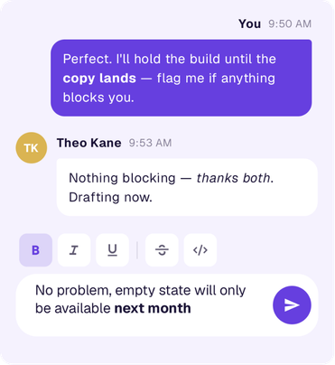
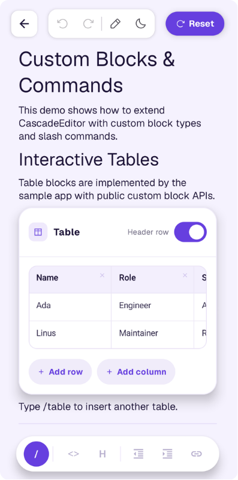

# Cascade Editor

A Compose Multiplatform editor that starts as a rich text input and scales into a block-based document editor.

Use Cascade Editor for a simple formatted comment field today. Keep the same editor when that field grows into product-specific rich text, HTML/JSON persistence, read-only previews, custom toolbars, slash commands, draggable blocks, or full Notion/Craft-style document editing without moving your editor core to WebView, contentEditable, or JavaScript.

Rich text input | HTML/JSON round-trip | Read-only rendering | Custom toolbars | Block editor | Android + iOS + Desktop

[](https://kotlinlang.org/docs/multiplatform.html)
[](https://www.jetbrains.com/compose-multiplatform/)
[](https://opensource.org/licenses/MIT)
[](https://developer.android.com/)
[](https://developer.apple.com/)
[](https://androidweekly.net/issues/issue-721)

**Try the live web demo:** [linreal.github.io/cascade-editor](https://linreal.github.io/cascade-editor/)

**Start here:**
[Rich text input](#i-need-a-rich-text-input) ·
[Import/export](#i-need-product-specific-importexport) ·
[Full block editor](#i-need-a-full-block-editor) ·
[Custom blocks](#extending-the-editor)


## Pick your starting point

Cascade Editor is designed for apps where rich text usually starts small and then grows.

### I need a rich text input



Use Cascade Editor as a constrained rich text field with bold, italic, links, inline code, toolbar controls, and predictable persistence.

Good for comments, notes, custom fields, descriptions, and short rich text inputs.

### I need product-specific import/export

Round-trip content through JSON or HTML-like formats, including custom backend dialects and app-specific rules.

Good for apps that already store rich text on the backend and cannot simply adopt another editor's internal format.

### I need a full block editor



Use structured blocks: paragraphs, headings, todos, quotes, lists, code blocks, dividers, indentation, drag-and-drop, slash commands, undo/redo, read-only mode, and custom block types.

Good for document editors, task descriptions, knowledge bases, note apps, and internal tools.

## When Cascade Editor is a good fit

| Need | Fit |
|---|---|
| Simple formatted input that may grow later | Strong fit |
| HTML/JSON persistence or backend rich-text dialect | Strong fit |
| Product-specific toolbar or formatting rules | Strong fit |
| Custom block renderers | Strong fit |
| Notion/Craft-style block editing | Strong fit |
| One-off formatted text field with no growth path | A simpler editor may be enough |

## Features

- **Rich text input** — bold, italic, underline, strikethrough, inline code, highlight, links, and custom styles inside text-capable blocks
- **Configurable formatting UI** — use the built-in toolbar, limit available actions, hide it, or render your own external toolbar
- **JSON and HTML round-trip** — save/load documents through `toJson()` / `loadFromJson()` or `toHtml()` / `loadFromHtml()`
- **HTML-like dialect support** — customize tag decoders, span encoders, block group encoders, parser policies, and backend-specific import/export rules
- **Read-only rendering** — show selectable, scrollable content while editor-owned mutations are disabled
- **Structured document editing** — paragraphs, headings, todos, bullet lists, numbered lists, quotes, code blocks, and dividers as independent blocks
- **Block editor workflows** — split, merge, convert, indent, reorder, drag-and-drop, slash commands, undo/redo, and list continuation
- **Custom block system** — add your own block types, renderers, slash commands, serialization, and product-specific behavior
- **Shared multiplatform editor core** — Android, iOS, and desktop from one Kotlin/Compose codebase, without WebView, contentEditable, or an embedded JavaScript editor
- **Reliability-oriented core** — crash containment, bounded no-throw JSON/HTML decode, structured warnings, deterministic reducers, and 1600+ tests

## Why this is not just a styled text field

Cascade Editor is built around a structured document model, not a single styled text buffer. Text formatting, block structure, undo/redo, indentation, drag-and-drop, serialization, read-only rendering, and custom block renderers all have to stay consistent across the same editor state.

Some of the harder problems handled by the editor core:

* each text-capable block owns a long-lived `TextFieldState`, while the document model remains serializable and reducer-driven;
* rich-text spans are preserved through typing, split, merge, replace, undo, and redo;
* structural edits such as list continuation, indentation, slash-command replacement, block conversion, and drag reorder are replayed as document transactions;
* JSON and HTML import/export are designed for backend round-trips, including custom block codecs and HTML-like dialects;
* most editor behavior lives in shared Kotlin `commonMain`, with platform-specific code kept to thin Compose adapters.

## Cascade Editor vs single-buffer rich text editors

| Area                | Cascade Editor                         | Single-buffer rich text editor   |
| ------------------- | -------------------------------------- | -------------------------------- |
| Content model       | Ordered block document                 | One styled text buffer           |
| Best starting point | Rich input that may grow               | Simple formatted text field      |
| Block operations    | Split, merge, convert, indent, reorder | Usually manual or unsupported    |
| Custom blocks       | First-class extension point            | Usually outside the editor model |
| Persistence         | Versioned JSON + HTML profiles         | App-specific                     |
| Backend dialects    | Custom import/export profiles          | Usually custom glue code         |
| Tradeoff            | More structure, more growth path       | Simpler initial integration      |


## Quick Start

Start with the smallest useful setup: one paragraph block, a limited toolbar, and slash commands disabled.

```groovy
implementation("io.github.linreal:cascade-editor:1.7.0")
```

```kotlin
@Composable
fun CommentInput() {
    val stateHolder = rememberEditorState(
        initialBlocks = listOf(
            Block.paragraph(text = "")
        )
    )

    CascadeEditor(
        modifier = Modifier.fillMaxWidth(),
        stateHolder = stateHolder,
        toolbar = ToolbarSlot.Default(
            config = RichTextToolbarConfig(
                buttons = listOf(
                    ToolbarButtonSpec(SpanStyle.Bold, "Bold"),
                    ToolbarButtonSpec(SpanStyle.Italic, "Italic"),
                ),
                showIndentation = false,
                showLink = true,
            )
        ),
        slashCommand = SlashCommandSlot.None,
    )
}
```

From here, you can keep the same editor state and add read-only previews, external toolbars, custom blocks, slash commands, drag-and-drop, and full document editing.

## Common integration paths

| Path                   | Start with | Add later                                  |
|------------------------|---|--------------------------------------------|
| Simple input           | Paragraph + limited toolbar | Custom spans, links, HTML export           |
| Custom field           | Read-only preview + edit screen | Backend HTML-like dialect                  |
| Task description       | Blocks + JSON/HTML persistence | Custom blocks, attachments, permissions    |
| Knowledge base / notes | Full block editor | Slash commands, drag/drop, custom renderers |

## Persistence and import/export

Cascade Editor is useful when rich text is not just UI state, but product data that must survive backend round-trips.

Save a document to JSON and restore it later:

```kotlin
// Save
val json = stateHolder.toJson(textStates, spanStates)

// Load
val result = stateHolder.loadFromJson(json, textStates, spanStates)
```

All block types, text content, rich text formatting, and supported indentation attributes are preserved through the round-trip. Unknown block types from newer editor versions are kept as-is, so re-saving does not silently drop data.

For custom block types, plug in `BlockTypeCodec` and `BlockContentCodec` to control how your types are serialized.

Documents can also round-trip through HTML for interchange with HTML-native systems:

```kotlin
// Save
val html = stateHolder.toHtml(textStates, spanStates, HtmlProfile.Default)

// Load
val result = stateHolder.loadFromHtml(html, textStates, spanStates, HtmlProfile.Default)
```

`HtmlProfile.Default` ships an HTML5-ish canonical mapping. For dialect-specific HTML, including Quill-flavored payloads, custom link attributes, flat `ql-indent-N` lists, and other backend rules, compose a custom profile from `HtmlProfile.Default` using `withTagDecoder()`, `withSpanEncoder()`, `withBlockGroupEncoder()`, and `withParserPolicy()`. See [HtmlImportExportFeatureContext.md](docs/HtmlImportExport.md) for the full extension recipe and the reference `CustomHtmlProfile` in `sample/`.

## Read-only rendering

A common pattern is to render content read-only in lists, previews, or permission-limited screens, then open the same document in edit mode elsewhere.

Use `CascadeEditorConfig(readOnly = true)` when the current user can view a document but cannot edit it:

```kotlin
CascadeEditor(
    stateHolder = stateHolder,
    config = CascadeEditorConfig(readOnly = true),
)
```

Read-only mode keeps normal viewer affordances: scrolling, native text selection/copy, and opening existing links from unfocused text blocks. The default toolbar remains visible, but mutating controls are disabled or no-op. To hide the toolbar, use the existing toolbar slot:

```kotlin
CascadeEditor(
    stateHolder = stateHolder,
    toolbar = ToolbarSlot.None,
    config = CascadeEditorConfig(readOnly = true),
)
```

This is a UI boundary inside `CascadeEditor`, not an application authorization layer. App-owned calls such as `stateHolder.dispatch(...)`, `undo()`, `redo()`, `loadFromJson(...)`, `loadFromHtml(...)`, autosave, remote sync, or direct `BlockTextStates` / `BlockSpanStates` writes remain the caller's responsibility. See [Read-Only Mode](docs/ReadOnlyMode.md) for the full behavior contract and custom renderer guidance.

To keep editing enabled but suppress block-level affordances, use `CascadeEditorConfig(blockSelectionEnabled = false)` and/or `CascadeEditorConfig(blockDraggingEnabled = false)`. `readOnly = true` still overrides both flags and disables all editor-owned mutations.

## Toolbar

For simple inputs, the toolbar is usually the main integration surface: choose which formatting actions are allowed, hide block-level controls, or replace the toolbar with your own app UI.

A built-in formatting toolbar ships with bold, italic, underline, strikethrough, inline code, highlight, and link editing. Keyboard shortcuts (Cmd/Ctrl+B/I/U) work even with the toolbar hidden.

Customize which buttons appear and in what order:

```kotlin
CascadeEditor(
    stateHolder = stateHolder,
    toolbar = ToolbarSlot.Default(
        config = RichTextToolbarConfig(
            buttons = listOf(
                ToolbarButtonSpec(SpanStyle.Bold, "Bold"),
                ToolbarButtonSpec(SpanStyle.Italic, "Italic"),
                ToolbarButtonSpec(SpanStyle.InlineCode, "Code"),
            )
        )
    ),
)
```

Or replace it entirely with your own composable. You get full access to `FormattingState` and `FormattingActions`:

```kotlin
CascadeEditor(
    stateHolder = stateHolder,
    toolbar = ToolbarSlot.Custom { formattingState, formattingActions ->
        // Render your own toolbar with formattingState.value and formattingActions.
    },
)
```

Need to sync formatting state with an external UI, such as an app bar? Use the `onFormattingStateChanged` callback:

```kotlin
CascadeEditor(
    stateHolder = stateHolder,
    toolbar = ToolbarSlot.None,
    onFormattingStateChanged = { formattingState ->
        // Mirror formattingState into your app bar state.
    },
)
```

For a fully external toolbar, create a controller with the same runtime holders you pass to the editor, hide the editor-owned toolbar, and render your toolbar wherever your app needs it:

```kotlin
@Composable
fun EditorWithExternalToolbar(
    stateHolder: EditorStateHolder,
    isReadOnly: Boolean,
    toolbarContent: @Composable (CascadeEditorToolbarController) -> Unit,
) {
    val textStates = remember { BlockTextStates() }
    val spanStates = remember { BlockSpanStates() }
    val editorConfig = CascadeEditorConfig(readOnly = isReadOnly)
    val toolbarController = rememberCascadeEditorToolbarController(
        stateHolder = stateHolder,
        textStates = textStates,
        spanStates = spanStates,
        config = editorConfig,
    )

    Column {
        toolbarContent(toolbarController)

        CascadeEditor(
            stateHolder = stateHolder,
            textStates = textStates,
            spanStates = spanStates,
            toolbar = ToolbarSlot.None,
            config = editorConfig,
        )
    }
}
```

## Theming and localization

Built-in light and dark presets, or full control over every visual detail:

```kotlin
// Use a preset
CascadeEditor(
    stateHolder = stateHolder,
    theme = CascadeEditorTheme.dark(),
)

// Or customize individual slots
CascadeEditor(
    stateHolder = stateHolder,
    theme = CascadeEditorTheme.light().copy(
        colors = CascadeEditorColors.light().copy(
            primary = Color(0xFF6750A4),
            cursor = Color(0xFF6750A4),
            quoteBorder = Color(0xFF6750A4),
        ),
    ),
)
```


`CascadeEditorColors` exposes 20+ slots: cursor, selection, toolbar icons, slash popup, quote borders, inline code background, highlight, and more. `CascadeEditorTypography` controls font size, weight, and family for every text element from body to headings to code blocks.

All UI strings are localizable via `CascadeEditorStrings` and `CascadeEditorBlockStrings`:

```kotlin
CascadeEditor(
    stateHolder = stateHolder,
    strings = CascadeEditorStrings.default().copy(bold = "Fett"),
)
```

## Full block editor

### Block types

| Type | Supports Text | Supports Indentation | Notes |
|------|:---:|:---:|-------|
| `Paragraph` | Yes | Yes | Default block type |
| `Heading(level)` | Yes | No | H1-H6 |
| `Todo(checked)` | Yes | Yes | Checkbox with toggle action |
| `BulletList` | Yes | Yes | Auto-detected from `- ` prefix |
| `NumberedList(number)` | Yes | Yes | Auto-renumbering on insert/delete/move, including nested outlines |
| `Quote` | Yes | No | Left border stripe + background tint |
| `Code` | Yes | No | Multi-line monospace block, no rich-text spans |
| `Divider` | No | No | Horizontal rule |

Extend with custom types via the `CustomBlockType` interface. See [Extending the editor](#extending-the-editor).

### Slash commands

Slash commands are optional. Enable them for document-style editing, or disable them for constrained inputs such as comments and custom fields.

```kotlin
CascadeEditor(
    stateHolder = stateHolder,
    slashCommand = SlashCommandSlot.None,
)
```

With slash commands enabled, typing `/` in any text block opens a Notion-style command palette with fuzzy search, keyboard navigation, and submenus without stealing focus from the text field.

Built-in commands for all block types are generated automatically. Add your own:

```kotlin
val slashRegistry = remember { SlashCommandRegistry() }

slashRegistry.register(
    SlashCommandAction(
        id = SlashCommandId("custom.timestamp"),
        title = "Timestamp",
        description = "Insert current date/time",
        onExecute = {
            editor.replaceQueryText(Clock.System.now().toString())
            SlashCommandResult.Done
        }
    )
)

CascadeEditor(
    stateHolder = stateHolder,
    slashRegistry = slashRegistry,
)
```

Custom commands get the full `SlashCommandContext`: replace text, swap blocks, insert new ones, or control focus. You can also organize commands into nested submenus with `SlashCommandMenu`.

### Undo & Redo

Undo/redo is built into `EditorStateHolder`. Continuous typing is coalesced into user-friendly history steps, while structural edits such as split, merge, drag reorder, slash commands, list conversion, and todo toggles replay as semantic document transactions instead of raw UI events.

History restores the focused block, visible-text selection/caret, and pending formatting styles on replay, so undo/redo returns the editor to the same editing context rather than only restoring block text.

```kotlin
Row {
    Button(
        onClick = { stateHolder.undo() },
        enabled = stateHolder.canUndo,
    ) {
        Text("Undo")
    }

    Button(
        onClick = { stateHolder.redo() },
        enabled = stateHolder.canRedo,
    ) {
        Text("Redo")
    }
}
```

Hardware keyboard shortcuts are built in: `Cmd/Ctrl+Z` for undo, `Shift+Cmd/Ctrl+Z` for redo.

See [Undo/Redo Feature Context](docs/UndoRedoFeatureContext.md) for the hybrid history model, replay behavior, and integration details.

### Indentation

Cascade Editor supports flat-outline indentation for paragraphs, todos, bullet lists, and numbered lists. The document remains an ordered `List<Block>`: depth is stored in `BlockAttributes.indentationLevel`, rendered as an animated leading inset, and preserved through split/merge, undo/redo, drag-and-drop, and save/load.

The default toolbar includes indent/outdent buttons when `RichTextToolbarConfig.showIndentation` is enabled, which it is by default. Commands shift the focused supported block or selected supported root blocks together with their descendants. Indentation is bounded to levels `0..5`; supported blocks can use any level in that range, and invalid outline moves no-op instead of producing hidden indentation on unsupported blocks.

```kotlin
CascadeEditor(
    stateHolder = stateHolder,
    toolbar = ToolbarSlot.Default(
        config = RichTextToolbarConfig.Default.copy(
            showIndentation = true,
        ),
    ),
)
```

Custom editor chrome can read the same state and actions from inside `CascadeEditor`:

```kotlin
val indentationState = LocalIndentationState.current?.value
val indentationActions = LocalIndentationActions.current

IconButton(
    enabled = indentationState?.canIndentForward == true,
    onClick = { indentationActions?.indentForward() },
) {
    Text("Indent")
}
```

Enter and Backspace understand nested list/todo behavior, and dragging can change block depth horizontally.

See [Indentation](docs/Indentation.md) for the flat-outline model, public API, serialization rules, and drag behavior.

## Extending the editor

When built-in blocks are not enough, add product-specific blocks without forking the editor.

```kotlin
public data object CalloutBlock : CustomBlockType {
    override val typeId: String = "callout"
    override val displayName: String = "Callout"
    override val supportsText: Boolean = true
}

public class CalloutBlockRenderer : BlockRenderer<CalloutBlock> {
    @Composable
    override fun Render(
        block: Block,
        isSelected: Boolean,
        isFocused: Boolean,
        modifier: Modifier,
        callbacks: BlockCallbacks,
    ) {
        // Your composable UI
    }
}

val registry = createEditorRegistry()
registry.register(
    BlockDescriptor(
        typeId = CalloutBlock.typeId,
        displayName = CalloutBlock.displayName,
        description = "Highlighted note block",
        keywords = listOf("callout", "note"),
        factory = { id ->
            Block(
                id = id,
                type = CalloutBlock,
                content = BlockContent.Text("")
            )
        },
    ),
    CalloutBlockRenderer()
)
```

For custom blocks that need to inspect editor state or commit block mutations from their own UI, implement `ScopedBlockRenderer`:

```kotlin
public class CalloutScopedRenderer : ScopedBlockRenderer<CalloutBlock> {
    @Composable
    override fun Render(
        block: Block,
        isSelected: Boolean,
        isFocused: Boolean,
        modifier: Modifier,
        callbacks: BlockCallbacks,
        scope: BlockRenderScope,
    ) {
        val readOnly = scope.readOnly
        val canMutate = !readOnly && scope.canUpdateBlock
    }
}
```

See [Interactive Custom Blocks](docs/CustomInteractiveBlocks.md) for scoped mutation patterns, read-only capability checks, and custom JSON payload guidance.

## Reliability

### Crash handling

The editor can contain its own internal failures so a single misbehaving block does not take down the host app. By default `CascadeEditorConfig` uses `CrashPolicy.ContainAndReport`: per-block measure/draw failures are caught at a containment boundary, the failing block degrades to a safe fallback, and the failure is surfaced through an optional host hook.

```kotlin
CascadeEditor(
    stateHolder = stateHolder,
    config = CascadeEditorConfig(
        crashPolicy = CrashPolicy.ContainAndReport,
        onInternalError = { error ->
            println("${error.context}: ${error.cause}")
        },
    ),
)
```

Use `CrashPolicy.Rethrow` in tests and debug builds to surface bugs instead of hiding them. The `onInternalError` reporter receives a `CascadeError(context, cause)` for routing into your own telemetry; it is never invoked under `Rethrow`.

Serialization entry points are always contain-and-warn, regardless of `crashPolicy`: `loadFromJson()` and `loadFromHtml()` never throw on malformed input. They abort to an empty/partial result and report `DocumentDecodeWarning.DocumentParseFailed` or `HtmlDecodeWarning.InputLimitExceeded` in the returned warning list. HTML decode is additionally bounded by `HtmlDecodeLimits` to guard against OOM on pathological input.

Composition-phase throws from custom renderers cannot be contained in-tree because Compose forbids `try/catch` around `@Composable` calls, so custom renderers remain a host trust boundary.

### Testing

1600+ tests across 117 test files cover reducers, history/undo/redo, span algorithms, slash commands, serialization, crash containment, drag-and-drop, and integration workflows. See [ARCHITECTURE.md](ARCHITECTURE.md) for the full test matrix.

```bash
./gradlew :editor:allTests
```

## Architecture

Cascade Editor uses a shared Kotlin editor core with strict layers for document state, text state, actions, registry, rendering, and serialization.

```
┌─────────────────────────────────────────────────────────┐
│  UI Layer (CascadeEditor, renderers, drag overlays)     │
├─────────────────────────────────────────────────────────┤
│  Text State Layer (BlockTextStates, TextFieldState)     │
├─────────────────────────────────────────────────────────┤
│  State Layer (EditorState, EditorStateHolder)           │
├─────────────────────────────────────────────────────────┤
│  Action Layer (EditorAction sealed hierarchy)           │
├─────────────────────────────────────────────────────────┤
│  Registry Layer (BlockRegistry, BlockDescriptor)        │
├─────────────────────────────────────────────────────────┤
│  Core Layer (Block, BlockType, BlockContent, TextSpan)  │
└─────────────────────────────────────────────────────────┘
```

Six layers with strict dependency direction keep editor behavior deterministic and testable. `BlockTextStates` owns one `TextFieldState` per block directly, avoiding cursor-jump and race-condition issues caused by reconstructing text state from composition side effects.

See [ARCHITECTURE.md](ARCHITECTURE.md) for the full quick-reference table, layer interactions, data flow details, and conventions.

## Engineering notes

Cascade Editor handles several problems that usually become painful when a rich text field grows into a document editor:

- keeping live `TextFieldState` and immutable document state aligned;
- preserving rich-text spans through split, merge, replace, typing, undo, and redo;
- supporting indentation, drag/reorder, serialization, custom renderers, and editor behavior from shared multiplatform code.

Most of this logic lives in `editor/src/commonMain`, with platform-specific code limited to thin Android/iOS/desktop adapters.

## Platform Requirements

| | Version |
|---|---|
| Kotlin | 2.3.21 |
| Compose Multiplatform | 1.11.0 |
| Android minSdk | 28 |
| Android compileSdk | 36 |
| iOS min version | 16.0 |
| iOS targets | arm64, simulatorArm64 |
| Desktop runtime | JDK 11+ |
| Desktop packaging | JDK 17+ |
| JVM target | 11 |

## Contributing

Contributions are welcome! See [CONTRIBUTING.md](CONTRIBUTING.md) for dev setup, code conventions, and PR guidelines.

## License

MIT
