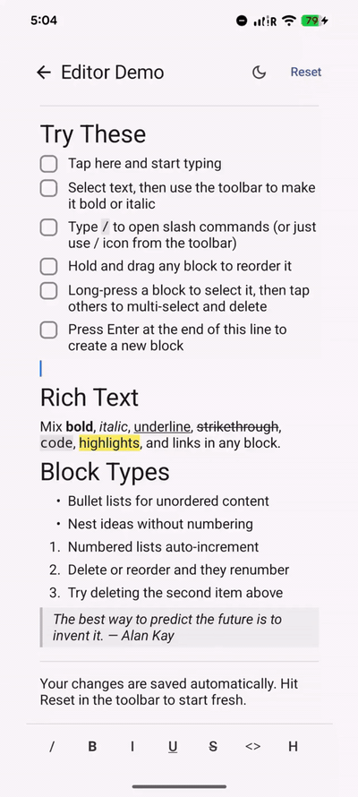
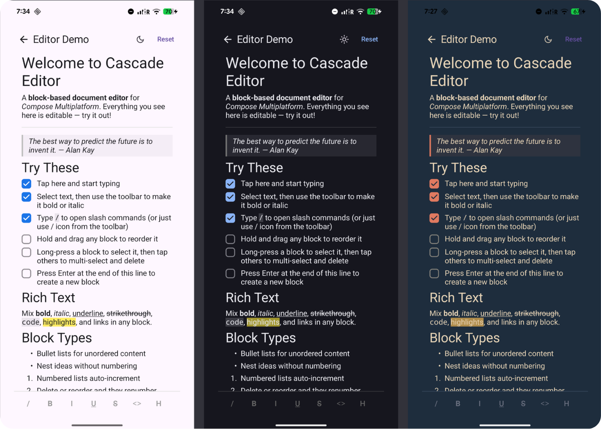

# Cascade Editor

The first native block-based editor for Compose Multiplatform.

Notion/Craft-style editing, implemented as a shared Kotlin editor core for Android, iOS, and desktop: draggable blocks, slash commands, undo/redo, rich-text spans, custom block types, and versioned document serialization, all without WebView, HTML/contentEditable, or embedded JavaScript editors.

Shared `commonMain` editor core | Android + iOS + Desktop | 950+ tests | No WebView | Extensible block registry

[](https://kotlinlang.org/docs/multiplatform.html)
[](https://www.jetbrains.com/compose-multiplatform/)
[](https://opensource.org/licenses/MIT)
[](https://developer.android.com/)
[](https://developer.apple.com/)
[](https://androidweekly.net/issues/issue-721)



## Why CascadeEditor?

Notion and Craft feel different from ordinary rich-text fields because the document is not a single styled text buffer. It is an ordered block document: paragraphs, headings, todos, quotes, lists, and dividers exist as structural units that can be inserted, converted, reordered, and serialized independently.

CascadeEditor brings that model to Compose Multiplatform natively. Each block has its own live text state, renderer, slash-command behavior, and serialization path, while rich-text spans still work inside text-capable blocks. That is what enables Notion-style editing on Android, iOS, and desktop without delegating the editor core to a WebView.

| Capability | CascadeEditor | Typical single-buffer rich-text editors |
|---|:---:|:---:|
| Document model | Ordered block document | Single styled text buffer |
| Independent block state/lifecycle | Yes | No |
| Block split / merge / convert | Yes | Limited / manual |
| Drag-and-drop reorder | Yes | No |
| Slash-command insertion | Yes | Rare / custom |
| Custom block renderers | Yes | Limited |
| Rich-text spans | Yes | Yes |
| Versioned document serialization | Yes | Limited / app-specific |

If you only need a formatted text area, a single-buffer editor is simpler. CascadeEditor is for apps that need a real document editor.

## Features

- **Structured document editing** — paragraphs, headings (H1-H6), todos, bullet lists, numbered lists, quotes, and dividers as independent blocks that can be inserted, split, merged, converted, reordered, and deleted
- **Notion-style editing workflows** — native drag-and-drop block reordering, slash-command insertion, undo/redo, list continuation, and structural editing behaviors without WebView
- **Rich-text spans inside blocks** — bold, italic, underline, strikethrough, inline code, highlight, and custom styles with span preservation across split, merge, and replace operations
- **Versioned document serialization** — `toJson()` / `loadFromJson()` with explicit schemas, codec hooks, and support for custom block types
- **Custom block system** — extend the editor with your own `CustomBlockType`, `BlockRenderer`, slash commands, and block-specific behavior
- **Shared multiplatform editor core** — one Kotlin codebase for Android, iOS, and desktop with native Compose rendering instead of HTML/contentEditable or embedded JavaScript editors
- **Theming and localization** — configurable colors, typography, and UI strings for integrating the editor into product-specific design systems

## Quick Start

Create a native block document with an initial heading and paragraph:

```groovy
implementation("io.github.linreal:cascade-editor:1.0.0")
```

```kotlin
@Composable
fun MyEditor() {
    val stateHolder = rememberEditorState(
        initialBlocks = listOf(
            Block.heading(level = 1, text = "Hello"),
            Block.paragraph(text = "Start editing..."),
        )
    )

    CascadeEditor(
        modifier = Modifier.fillMaxSize(),
        stateHolder = stateHolder
    )
}
```

From here you can add undo/redo controls, slash commands, custom block renderers, theming, and JSON serialization.

## Theming

Built-in light and dark presets, or full control over every visual detail:

```kotlin
// Use a preset
CascadeEditor(
    stateHolder = stateHolder,
    theme = CascadeEditorTheme.dark(),
)

// Or customize individual slots
CascadeEditor(
    stateHolder = stateHolder,
    theme = CascadeEditorTheme.light().copy(
        colors = CascadeEditorColors.light().copy(
            primary = Color(0xFF6750A4),
            cursor = Color(0xFF6750A4),
            quoteBorder = Color(0xFF6750A4),
        ),
    ),
)
```


`CascadeEditorColors` exposes 20+ slots — cursor, selection, toolbar icons, slash popup, quote borders, inline code background, highlight, and more. `CascadeEditorTypography` controls font size, weight, and family for every text element from body to headings to code blocks.

All UI strings are localizable via `CascadeEditorStrings` and `CascadeEditorBlockStrings`:

```kotlin
CascadeEditor(
    stateHolder = stateHolder,
    strings = CascadeEditorStrings.default().copy(bold = "Fett"),
)
```

## Slash Commands

Type `/` in any text block to open a Notion-style command palette — fuzzy search, keyboard navigation, submenus — all without stealing focus from the text field.

Built-in commands for all block types are generated automatically. Add your own:

```kotlin
val slashRegistry = remember { SlashCommandRegistry() }

slashRegistry.register(
    SlashCommandAction(
        id = SlashCommandId("custom.timestamp"),
        title = "Timestamp",
        description = "Insert current date/time",
        onExecute = {
            editor.replaceQueryText(Clock.System.now().toString())
            SlashCommandResult.Done
        }
    )
)

CascadeEditor(
    stateHolder = stateHolder,
    slashRegistry = slashRegistry,
)
```

Custom commands get the full `SlashCommandContext` — replace text, swap blocks, insert new ones, or control focus. You can also organize commands into nested submenus with `SlashCommandMenu`.

## Toolbar

A built-in formatting toolbar ships with bold, italic, underline, strikethrough, inline code, and highlight — plus keyboard shortcuts (Cmd/Ctrl+B/I/U) that work even with the toolbar hidden.

Customize which buttons appear and in what order:

```kotlin
CascadeEditor(
    stateHolder = stateHolder,
    toolbar = ToolbarSlot.Default(
        config = RichTextToolbarConfig(
            buttons = listOf(
                ToolbarButtonSpec(SpanStyle.Bold, "Bold"),
                ToolbarButtonSpec(SpanStyle.Italic, "Italic"),
                ToolbarButtonSpec(SpanStyle.InlineCode, "Code"),
            )
        )
    ),
)
```

Or replace it entirely with your own composable — you get full access to `FormattingState` and `FormattingActions`:

```kotlin
CascadeEditor(
    stateHolder = stateHolder,
    toolbar = ToolbarSlot.Custom { formattingState, formattingActions ->
        MyCustomToolbar(formattingState, formattingActions)
    },
)
```

Need to sync formatting state with an external UI (like an app bar)? Use the `onFormattingStateChanged` callback:

```kotlin
CascadeEditor(
    stateHolder = stateHolder,
    toolbar = ToolbarSlot.None,
    onFormattingStateChanged = { state -> updateAppBar(state) },
)
```

## Undo & Redo

Undo/redo is built into `EditorStateHolder`. Continuous typing is coalesced into user-friendly history steps, while structural edits such as split, merge, drag reorder, slash commands, list conversion, and todo toggles replay as semantic document transactions instead of raw UI events.

History restores the focused block, visible-text selection/caret, and pending formatting styles on replay, so undo/redo returns the editor to the same editing context rather than only restoring block text.

```kotlin
Row {
    Button(
        onClick = { stateHolder.undo() },
        enabled = stateHolder.canUndo,
    ) {
        Text("Undo")
    }

    Button(
        onClick = { stateHolder.redo() },
        enabled = stateHolder.canRedo,
    ) {
        Text("Redo")
    }
}
```

Hardware keyboard shortcuts are built in: `Cmd/Ctrl+Z` for undo, `Shift+Cmd/Ctrl+Z` for redo.

See [Undo/Redo Feature Context](docs/UndoRedoFeatureContext.md) for the hybrid history model, replay behavior, and integration details.

## Block Types

| Type | Supports Text | Notes |
|------|:---:|-------|
| `Paragraph` | Yes | Default block type |
| `Heading(level)` | Yes | H1–H6 |
| `Todo(checked)` | Yes | Checkbox with toggle action |
| `BulletList` | Yes | Auto-detected from `- ` prefix |
| `NumberedList(number)` | Yes | Auto-renumbering on insert/delete/move |
| `Quote` | Yes | Left border stripe + background tint |
| `Divider` | No | Horizontal rule |

Extend with custom types via the `CustomBlockType` interface (see [Custom Block Types](#custom-block-types)).

## Custom Block Types

```kotlin
public data object CalloutBlock : CustomBlockType {
    override val typeId: String = "callout"
    override val displayName: String = "Callout"
    override val supportsText: Boolean = true
}

public class CalloutBlockRenderer : BlockRenderer<CalloutBlock> {
    @Composable
    override fun Render(
        block: Block,
        isSelected: Boolean,
        isFocused: Boolean,
        modifier: Modifier,
        callbacks: BlockCallbacks,
    ) {
        // Your composable UI
    }
}

val registry = createEditorRegistry()
registry.register(
    BlockDescriptor(typeId = "callout", displayName = "Callout"),
    CalloutBlockRenderer()
)
```

## Save & Load

Save a document to JSON and restore it later — two lines:

```kotlin
// Save
val json = stateHolder.toJson(textStates, spanStates)

// Load
val result = stateHolder.loadFromJson(json, textStates, spanStates)
```

All block types, text content, and rich text formatting (bold, italic, etc.) are preserved through the round-trip. Unknown block types from newer editor versions are kept as-is — no silent data loss on re-save.

For custom block types, plug in `BlockTypeCodec` and `BlockContentCodec` to control how your types are serialized.

## Architecture

```
┌─────────────────────────────────────────────────────────┐
│  UI Layer (CascadeEditor, renderers, drag overlays)     │
├─────────────────────────────────────────────────────────┤
│  Text State Layer (BlockTextStates, TextFieldState)     │
├─────────────────────────────────────────────────────────┤
│  State Layer (EditorState, EditorStateHolder)           │
├─────────────────────────────────────────────────────────┤
│  Action Layer (EditorAction sealed hierarchy)           │
├─────────────────────────────────────────────────────────┤
│  Registry Layer (BlockRegistry, BlockDescriptor)        │
├─────────────────────────────────────────────────────────┤
│  Core Layer (Block, BlockType, BlockContent, TextSpan)  │
└─────────────────────────────────────────────────────────┘
```

Six layers with strict dependency direction. The reducer pattern ensures every state transition is deterministic — testable in isolation without mocks or UI infrastructure. `BlockTextStates` owns one `TextFieldState` per block directly, avoiding the cursor-jump and race-condition issues that `LaunchedEffect`-based syncing causes.

See [ARCHITECTURE.md](ARCHITECTURE.md) for the full quick-reference table (90+ public symbols), layer interactions, data flow details, and conventions.

## Engineering Challenges Solved

This is not a styled text field. CascadeEditor combines block-structured document editing, rich-text ranges, slash commands, drag-and-drop, undo/redo, and serialization in shared Compose Multiplatform code. The difficulty is preserving correct behavior across compound editing operations, not rendering individual UI controls.

**Live runtime state and immutable document state must stay aligned.** Each text-capable block owns a long-lived `TextFieldState` for live editing, while the document model remains an immutable `EditorState` used by reducers, persistence, and structural operations. Split, merge, slash-command edits, and list conversion can mutate the live buffer first and the snapshot second, so `BlockTextStates` records pending programmatic commits and `SpanMaintenanceTextObserver` rebases against the committed result instead of treating it as user input. That is the mechanism that prevents runtime/snapshot drift during compound operations.

**Rich-text formatting has to survive split, merge, replace, and typing workflows.** Formatting is represented as `TextSpan` ranges in visible-text coordinates, not raw buffer coordinates. `SpanAlgorithms` handles normalization, edit adjustment, split, merge, apply/remove/toggle, and style queries, and the same algorithms are reused by runtime holders and snapshot reducers. If those paths diverge, formatting silently corrupts on the next operation. The pure algorithm suite in `SpanAlgorithmsTest.kt` currently covers this surface with 100 tests, with additional reducer and integration tests covering split/merge handoff.

**Undo/redo has to replay both history checkpoints and live editing state.** The history model is hybrid and linear: typing, deletion, and eligible one-block formatting edits use compact block-local entries, while split, merge, drag reorder, slash commands, and other semantic document changes use full-document checkpoints. Replay restores the focused block, exact visible-text selection, and pending styles, and reuses existing `TextFieldState` instances where possible to avoid unnecessary IME reconnection during undo/redo.

**The editor owns text buffers directly instead of reconstructing them from composition side effects.** `BlockTextStates` keeps one `TextFieldState` per block across recompositions. That enables direct buffer edits for merge, split, slash replacement, and list auto-detection without recreating text state from snapshot data or re-deriving cursor position after every structural change. This is an architectural choice that simplifies block-local editing invariants.

**Span maintenance runs after commit, not inside the input pipeline.** `TextBlockField` observes committed text and selection with `snapshotFlow`, and `SpanMaintenanceTextObserver` updates span coordinates after the edit is accepted. It also resolves continuation rules for typing at formatting boundaries and explicit pending styles from toolbar actions. Keeping span maintenance post-commit isolates formatting logic from IME-driven text entry.

**Drag auto-scroll has to coexist with an active gesture.** During block drag, the list must scroll while pointer input remains owned by the drag handler. `AutoScrollDuringDrag` uses `LazyListState.dispatchRawDelta()` instead of `scroll {}` because the standard scroll path acquires the scroll `MutatorMutex` and interferes with the active drag gesture. After each delta, the editor recomputes the drop target against the shifted viewport so reorder feedback stays correct while the list is moving.

**Most of the hard logic lives in shared multiplatform code.** Core models, reducers, slash-command infrastructure, serialization, span algorithms, state holders, and most editor behavior live in `editor/src/commonMain`, with platform-specific code limited to thin Android/iOS/desktop adapters. That means the non-trivial parts are implemented once and have to remain correct across all supported targets, rather than being delegated to a platform-specific text widget.

## Testing

950+ tests across 52 test files — reducers, history/undo/redo, span algorithms, slash commands, serialization, drag-and-drop, and integration workflows. See [ARCHITECTURE.md](ARCHITECTURE.md) for the full test matrix.

```bash
./gradlew :editor:allTests
```

## Platform Requirements

| | Version |
|---|---|
| Kotlin | 2.3.20 |
| Compose Multiplatform | 1.10.3 |
| Android minSdk | 28 |
| Android compileSdk | 36 |
| iOS min version | 16.0 |
| iOS targets | arm64, simulatorArm64 |
| Desktop runtime | JDK 11+ |
| Desktop packaging | JDK 17+ |
| JVM target | 11 |


## Contributing

Contributions are welcome! See [CONTRIBUTING.md](CONTRIBUTING.md) for dev setup, code conventions, and PR guidelines.

## License

MIT
